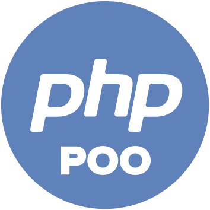

# [PHP](https://www.php.net/manual/fr/language.oop5.php)

 

Par **Rachid EDJEKOUANE ⭐️**

---

Introduction à la programmation orienté objet

Durée : 5 jours (35 heures au total)

Objectif du cours : L'objectif est de familiariser les participants avec les principes et les techniques de la programmation orientée objet en PHP pour leur permettre de développer des applications web robustes et modulaires.

---

## Jour 1 : Introduction à la POO et fondamentaux de PHP

-   Présentation de la formation et des objectifs
-   Introduction à la programmation orientée objet (POO)
-   Les principes de base de PHP
-   Installation et configuration de l'environnement de développement (WAMP, XAMPP, etc.)
-   Structure d'un programme PHP
-   Variables, types de données et opérations de base
-   Les fonctions et les classes en PHP

## Jour 2 : Concepts avancés de POO

-   Rappel des concepts fondamentaux de la POO
-   Les classes et les objets en PHP
-   Les propriétés et les méthodes
-   L'encapsulation, l'héritage et le polymorphisme
-   Les espaces de noms (namespaces)
-   Les exceptions

## Jour 3 : Application de la POO en PHP

-   Concevoir et créer des classes
-   Utilisation des méthodes magiques (constructeurs, destructeurs, etc.)
-   Gestion des erreurs et des exceptions
-   Utilisation de l'héritage pour étendre des classes existantes
-   Implémentation d'interfaces
-   Création de relations entre classes (agrégation, composition)

## Jour 4 : Modélisation et conception de classes

-   Introduction à la modélisation de classes
-   Analyse et conception d'un système en utilisant des diagrammes de classes
-   Relation entre les classes (associations, agrégations, compositions)
-   Utilisation de l'héritage pour modéliser des relations
-   Méthodes abstraites et classes abstraites
-   Utilisation de la surcharge (overloading) et du surchargement (overriding)

## Jour 5 : Application pratique et bonnes pratiques

-   Réalisation d'un projet pratique en utilisant la POO en PHP
-   Revue des bonnes pratiques en matière de développement orienté objet
-   Revue générale de la formation et séance de questions-réponses
-   QCM de validation de la semaine

---

_Ces objectifs peuvent être adaptés en fonction des besoins spécifiques du groupe de personnes débutantes en formation au développement web._
